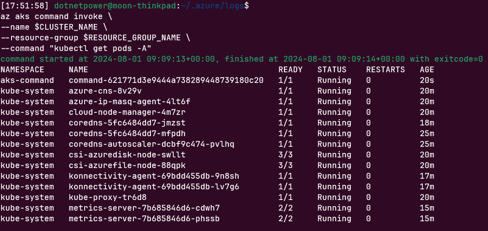

[⬅️목차](./README.md)

# Egress 의 type 을 기본 Loadbalancer 에서 UserDefinedRouting 으로 변경하여 PIP 생성을 방지

다음 문서 참조: https://learn.microsoft.com/ko-kr/azure/aks/limit-egress-traffic?tabs=aks-with-system-assigned-identities

### 개요 
- Hub - Spoke 구성을 위해 리소스 그룹으로 구성
- Spoke 의 Vnet 과 Hub 의 Vnet 을 Peering 연결하고 outbound 에 대해서는 Hub 의 방화벽을 통해 나가도록 구성
- Public IP 생성하지 않고 outboundType 을 UserDefinedRouting 을 통해 방화벽으로 트래픽 전달
- API 서버도 Private 으로 생성하여 외부에서 API 서버 접근 통제
- AGIC 를 사용하지 않고 AKS CNI Overlay 구성

### 예제 구성 A
Private 망의 CNI Overlay 구성, PIP 가 생성되지 않도록 구성

```
############################################################################
# 환경변수
############################################################################
# Hub 구성 변수
RESOURCE_GROUP_HUB_NAME="aks-lza-hug-rg"
VNET_HUB_NAME="vnet-hub"
SUBNET_HUB_NAME="sbn-hub"
FIREWALL_NAME="afw-hub-01"
FW_PUBLIC_IP_NAME="pip-hub-fw-01"
FW_PUBLIC_IP_CFG_NAME="pip-cfg-hub-fw-01"
FW_ROUTE_NAME="udr-fwrn"
FW_ROUTE_NAME_INTERNET="udr-fwinternet"

VNET_ADDRESS_PREFIXES="10.200.0.0/16"
VNET_SUBNET_PREFIXES="10.200.1.0/24"
FW_SUBNET_PREFIXES="10.200.2.0/24"


# Spoke 구성 변수, mmdd-HHMM 형태의 이름으로 리소스 그룹을 생성
DEPLOY_SUFFIX=$(date "+%m%d-%H%M")
RESOURCE_GROUP_NAME="aks-lza-spoke-rg-$DEPLOY_SUFFIX"
LOCATION="koreacentral"
CLUSTER_NAME="aks-cluster"
VNET_SPOKE_NAME="vnet-spoke1-$DEPLOY_SUFFIX"
SUBNET_NAME="snet-clusternodes-$DEPLOY_SUFFIX"
UDR_NAME="udr-spoke1-$DEPLOY_SUFFIX"
AAD_GROUP_NAME="aksadmin"
AKS_CONTROL_NAME="aks-control-id-$DEPLOY_SUFFIX"
AKS_KUBELET_NAME="aks-kubelet-id-$DEPLOY_SUFFIX"

VNET_SPOKE_ADDRESS_PREFIXES="10.240.0.0/16"
VNET_SPOKE_SUBNET_PREFIXES="10.240.1.0/24"


############################################################################
# 리소스 생성 - HUB
############################################################################

echo "
#---------------------------------------------------------------------------
# [HUB]리소스 그룹 생성
#---------------------------------------------------------------------------"
az group create --resource-group $RESOURCE_GROUP_HUB_NAME --location $LOCATION

echo "
#---------------------------------------------------------------------------
# [HUB]VNET 생성
#---------------------------------------------------------------------------"
az network vnet create \
--resource-group $RESOURCE_GROUP_HUB_NAME \
--location $LOCATION \
--name $VNET_HUB_NAME \
--address-prefixes $VNET_ADDRESS_PREFIXES \
--subnet-name $SUBNET_HUB_NAME \
--subnet-prefix $VNET_SUBNET_PREFIXES

echo "
#---------------------------------------------------------------------------
# [HUB]Firewall Subnet 생성 - 이름은 AzureFirewallSubnet 으로 고정
#---------------------------------------------------------------------------"
az network vnet subnet create \
--resource-group $RESOURCE_GROUP_HUB_NAME \
--vnet-name $VNET_HUB_NAME \
--name AzureFirewallSubnet \
--address-prefixes $FW_SUBNET_PREFIXES

echo "
#---------------------------------------------------------------------------
# [HUB]Vnet id 저장
#---------------------------------------------------------------------------"
VNET_HUB_ID=$(az network vnet show --resource-group $RESOURCE_GROUP_HUB_NAME --name $VNET_HUB_NAME --query id -o tsv)

echo "
#---------------------------------------------------------------------------
# azure-firewall extension 추가
#---------------------------------------------------------------------------"
az extension add --name azure-firewall

echo "
#---------------------------------------------------------------------------
# Firewall 생청
#---------------------------------------------------------------------------"
az network firewall create \
--resource-group $RESOURCE_GROUP_HUB_NAME \
--name $FIREWALL_NAME \
--location $LOCATION \
--enable-dns-proxy true \
--debug

echo "
#---------------------------------------------------------------------------
# public ip 생성
#---------------------------------------------------------------------------"
az network public-ip create \
--resource-group $RESOURCE_GROUP_HUB_NAME \
--name $FW_PUBLIC_IP_NAME \
--location $LOCATION \
--sku "Standard" \
--debug

echo "
#---------------------------------------------------------------------------
# Firewall IP 구성
#---------------------------------------------------------------------------"
az network firewall ip-config create \
--resource-group $RESOURCE_GROUP_HUB_NAME \
--firewall-name $FIREWALL_NAME \
--name $FW_PUBLIC_IP_CFG_NAME \
--public-ip-address $FW_PUBLIC_IP_NAME \
--vnet-name $VNET_HUB_NAME \
--debug

echo "
#---------------------------------------------------------------------------
# Firewall Public IP 조회
#---------------------------------------------------------------------------"
FWPUBLIC_IP=$(az network public-ip show \
--resource-group $RESOURCE_GROUP_HUB_NAME \
--name $FW_PUBLIC_IP_NAME \
--query "ipAddress" -o tsv)
echo "Firewall Public IP: $FWPUBLIC_IP"

echo "
#---------------------------------------------------------------------------
# Firewall Private IP 조회
#---------------------------------------------------------------------------"
FWPRIVATE_IP=$(az network firewall show \
--resource-group $RESOURCE_GROUP_HUB_NAME \
--name $FIREWALL_NAME \
--query "ipConfigurations[0].privateIPAddress" -o tsv)
echo "Firewall Private IP: $FWPRIVATE_IP"

echo "
#---------------------------------------------------------------------------
# Firewall 규칙
#---------------------------------------------------------------------------"
# az network firewall network-rule create --resource-group $RESOURCE_GROUP_HUB_NAME --firewall-name $FIREWALL_NAME --collection-name 'aksfwnr' # --name 'apiudp' --protocols 'UDP' --source-addresses '*' --destination-addresses "AzureCloud.$LOCATION" --destination-ports 1194 --action # allow --priority 100

# az network firewall network-rule create --resource-group $RESOURCE_GROUP_HUB_NAME --firewall-name $FIREWALL_NAME --collection-name 'aksfwnr' # --name 'apitcp' --protocols 'TCP' --source-addresses '*' --destination-addresses "AzureCloud.$LOCATION" --destination-ports 9000

# az network firewall network-rule create --resource-group $RESOURCE_GROUP_HUB_NAME --firewall-name $FIREWALL_NAME --collection-name 'aksfwnr' # --name 'time' --protocols 'UDP' --source-addresses '*' --destination-fqdns 'ntp.ubuntu.com' --destination-ports 123

# az network firewall network-rule create --resource-group $RESOURCE_GROUP_HUB_NAME --firewall-name $FIREWALL_NAME --collection-name 'aksfwnr' # --name 'ghcr' --protocols 'TCP' --source-addresses '*' --destination-fqdns ghcr.io pkg-containers.githubusercontent.com --destination-ports # '443'

# az network firewall network-rule create --resource-group $RESOURCE_GROUP_HUB_NAME --firewall-name $FIREWALL_NAME --collection-name 'aksmcr' -# -name 'mcr' --protocols 'TCP' --source-addresses '*' --destination-fqdns 'mcr.microsoft.com' --destination-ports '443'

# az network firewall network-rule create --resource-group $RESOURCE_GROUP_HUB_NAME --firewall-name $FIREWALL_NAME --collection-name 'aksfwnr' --name 'docker' --protocols 'TCP' --source-addresses '*' --destination-fqdns docker.io registry-1.docker.io production.cloudflare.docker.com --destination-ports '443'

echo "
#---------------------------------------------------------------------------
# Firewall 에 application-rule 규칙 생성 AzureKubernetesService 로 일괄 적용 
#---------------------------------------------------------------------------"
az network firewall application-rule create \
--resource-group $RESOURCE_GROUP_HUB_NAME \
--firewall-name $FIREWALL_NAME \
--collection-name 'aksfwar' \
--name 'fqdn' \
--source-addresses '*' \
--protocols 'http=80' 'https=443' \
--fqdn-tags "AzureKubernetesService" \
--action allow \
--priority 100


############################################################################
# 리소스 생성 - SPOKE
############################################################################

# 리소스 그룹 출력
echo $RESOURCE_GROUP_NAME

echo "
#---------------------------------------------------------------------------
# [SPOKE]리소스 그룹 생성
#---------------------------------------------------------------------------"
az group create --resource-group $RESOURCE_GROUP_NAME --location $LOCATION

echo "
#---------------------------------------------------------------------------
# [SPOKE]VNET 생성
#---------------------------------------------------------------------------"
az network vnet create \
--resource-group $RESOURCE_GROUP_NAME \
--location $LOCATION \
--name $VNET_SPOKE_NAME \
--address-prefixes $VNET_SPOKE_ADDRESS_PREFIXES

echo "
#---------------------------------------------------------------------------
# [SPOKE]Vnet id 저장
#---------------------------------------------------------------------------"
VNET_SPOKE_ID=$(az network vnet show --resource-group $RESOURCE_GROUP_NAME --name $VNET_SPOKE_NAME --query id -o tsv)


echo "
#---------------------------------------------------------------------------
# [SPOKE-HUB]Hub Vnet 과 peering !! Hub 에서 Peering 이 나오지 않으니 Hub 에서도 Peering 추가되어야 한다.
#---------------------------------------------------------------------------"
az network vnet peering create \
--resource-group $RESOURCE_GROUP_NAME \
--name Peering-$VNET_SPOKE_NAME \
--vnet-name $VNET_SPOKE_NAME \
--remote-vnet $VNET_HUB_ID \
--allow-vnet-access

echo "
#---------------------------------------------------------------------------
# [HUB-SPOKE]Hub 에서도 Peering 추가
#---------------------------------------------------------------------------"
az network vnet peering create \
--resource-group $RESOURCE_GROUP_HUB_NAME \
--name PeeringToSpoke-$VNET_SPOKE_NAME \
--vnet-name $VNET_HUB_NAME \
--remote-vnet $VNET_SPOKE_ID \
--allow-vnet-access

echo "
#---------------------------------------------------------------------------
# [SPOKE]Route Table 생성
#---------------------------------------------------------------------------"
az network route-table create \
--resource-group $RESOURCE_GROUP_NAME \
--name $UDR_NAME

echo "
#---------------------------------------------------------------------------
# [SPOKE]Route Table 규칙(0.0.0.0) 생성 Next Hops 를 VirtualAppliance 로 설정
#---------------------------------------------------------------------------"
az network route-table route create \
--resource-group $RESOURCE_GROUP_NAME \
--route-table-name $UDR_NAME \
--name $FW_ROUTE_NAME \
--next-hop-type VirtualAppliance \
--address-prefix 0.0.0.0/0 \
--next-hop-ip-address $FWPRIVATE_IP

echo "
#---------------------------------------------------------------------------
# [SPOKE]Route Table 규칙 Public IP 의 Next Hops 를 Internet 으로 설정
#---------------------------------------------------------------------------"
# az network route-table route create \
# --resource-group $RESOURCE_GROUP_NAME \
# --name $FW_ROUTE_NAME_INTERNET \
# --route-table-name $UDR_NAME \
# --address-prefix $FWPUBLIC_IP/32 \
# --next-hop-type Internet

echo "
#---------------------------------------------------------------------------
# [SPOKE]Subnet 생성
#---------------------------------------------------------------------------"
az network vnet subnet create \
--resource-group $RESOURCE_GROUP_NAME \
--vnet-name $VNET_SPOKE_NAME \
--name $SUBNET_NAME \
--address-prefixes $VNET_SPOKE_SUBNET_PREFIXES \
--route-table $UDR_NAME

echo "
#---------------------------------------------------------------------------
# AKS subnet의 라우트테이블 업데이트
#---------------------------------------------------------------------------"
az network vnet subnet update \
--resource-group $RESOURCE_GROUP_NAME \
--vnet-name $VNET_SPOKE_NAME \
--name $SUBNET_NAME \
--route-table $UDR_NAME

echo "
#---------------------------------------------------------------------------
# [SPOKE]VNET_SUBNET_ID 가져오기
#---------------------------------------------------------------------------"
VNET_SUBNET_ID=$(az network vnet subnet show --resource-group $RESOURCE_GROUP_NAME --vnet-name $VNET_SPOKE_NAME --name $SUBNET_NAME --query id -o tsv)

echo "
#---------------------------------------------------------------------------
# Entra ID 에 그룹을 생성하고 나 자신을 그룹에 추가
# 생성된 그룹을 사용할 경우에는 해당 그룹의 ID 를 아래 AAD_GROUP_ID 변수에 설정 필요!!
#---------------------------------------------------------------------------"
USER_PRINCIPAL_ID=$(az ad signed-in-user show --query id -o tsv)
echo $USER_PRINCIPAL_ID

echo "
#---------------------------------------------------------------------------
# 그룹 생성
#---------------------------------------------------------------------------"
az ad group create --display-name $AAD_GROUP_NAME --mail-nickname $AAD_GROUP_NAME

echo "
#---------------------------------------------------------------------------
# 생성된 그룹에 로그인 사용자의 object id 추가
#---------------------------------------------------------------------------"
az ad group member add --group $AAD_GROUP_NAME --member-id $USER_PRINCIPAL_ID

echo "
#---------------------------------------------------------------------------
# 그룹ID 가져오기
#---------------------------------------------------------------------------"
AAD_GROUP_ID=$(az ad group show --group $AAD_GROUP_NAME --query id -o tsv)


echo "
#---------------------------------------------------------------------------
# User Defined 관리ID 생성 - AKS_CONTROL_NAME
#---------------------------------------------------------------------------"
az identity create \
--resource-group $RESOURCE_GROUP_NAME \
--name $AKS_CONTROL_NAME

AKS_CONTROL_ID=$(az identity show --resource-group $RESOURCE_GROUP_NAME --name $AKS_CONTROL_NAME --query id -o tsv)

echo "
#---------------------------------------------------------------------------
# AKS_CONTROL_NAME을 route table 에 대한 contributor 권한 부여
#---------------------------------------------------------------------------"
AKS_CONTROL_PID=$(az identity show --resource-group $RESOURCE_GROUP_NAME --name $AKS_CONTROL_NAME --query principalId -o tsv)

UDR_ID=$(az network route-table show \
--resource-group $RESOURCE_GROUP_NAME \
--name $UDR_NAME --query id -o tsv)

echo "
#---------------------------------------------------------------------------
# UDR에 AKS_CONTROL 을 Contributor 로 역할 부여
#---------------------------------------------------------------------------"
az role assignment create \
--assignee $AKS_CONTROL_PID \
--role "Contributor" \
--scope $UDR_ID

echo "
#---------------------------------------------------------------------------
# User Defined 관리ID 생성 - AKS_KUBELET_NAME
#---------------------------------------------------------------------------"
az identity create \
--resource-group $RESOURCE_GROUP_NAME \
--name $AKS_KUBELET_NAME

AKS_KUBELET_ID=$(az identity show --resource-group $RESOURCE_GROUP_NAME --name $AKS_KUBELET_NAME --query id -o tsv)

echo "
#---------------------------------------------------------------------------
# AKS_KUBELET_ID 에 AKS_CONTROL_ID 의 역할을 Managed Identity Operator 로 지정
#---------------------------------------------------------------------------"
az role assignment create \
--assignee $AKS_CONTROL_PID \
--role "Managed Identity Operator" \
--scope $AKS_KUBELET_ID


echo -e "\e[33m[시작::AKS 생성]$(date)"

echo "
#---------------------------------------------------------------------------
# [SPOKE]AKS 생성 (약 10분)
#---------------------------------------------------------------------------"

# Private cluster 로 생성
az aks create \
--name $CLUSTER_NAME \
--resource-group $RESOURCE_GROUP_NAME \
--location $LOCATION \
--enable-private-cluster \
--kubernetes-version 1.29.4 \
--node-count 1 \
--network-plugin azure \
--network-plugin-mode overlay \
--vnet-subnet-id $VNET_SUBNET_ID \
--service-cidr 10.0.0.0/22 \
--pod-cidr 180.10.0.0/16 \
--generate-ssh-keys \
--enable-aad \
--aad-admin-group-object-ids $AAD_GROUP_ID \
--outbound-type userDefinedRouting \
--enable-managed-identity \
--assign-identity $AKS_CONTROL_ID \
--assign-kubelet-identity $AKS_KUBELET_ID --debug


# Private cluster 로 생성
# az aks create \
# --name $CLUSTER_NAME \
# --resource-group $RESOURCE_GROUP_NAME \
# --location $LOCATION \
# --enable-private-cluster \
# --kubernetes-version 1.29.4 \
# --max-pods 250 \
# --node-count 2 \
# --network-plugin azure \
# --network-plugin-mode overlay \
# --vnet-subnet-id $VNET_SUBNET_ID \
# --service-cidr 10.0.0.0/22 \
# --pod-cidr 180.10.0.0/16 \
# --enable-addons monitoring \
# --generate-ssh-keys \
# --enable-aad \
# --aad-admin-group-object-ids $AAD_GROUP_ID \
# --outbound-type userDefinedRouting \
# --enable-managed-identity \
# --assign-identity $AKS_CONTROL_ID \
# --assign-kubelet-identity $AKS_KUBELET_ID --debug


echo -e "\e[33m[완료]$(date)"


############################################################################
# Run command 를 통한 테스트
############################################################################
az aks command invoke \
--name $CLUSTER_NAME \
--resource-group $RESOURCE_GROUP_NAME \
--command "kubectl get pods -A"
```
